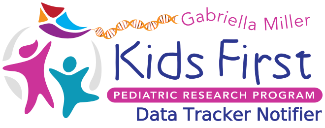

  

  
  

# Kids First Data Tracker Notifier

A lambda to send notifications for the data tracker.

## Configuration

The lambda needs to be configured with the correct variables in the environment
to be able to send messages to Slack:

- `AUTH0_CLIENT` - Auth0 client id used to authenticate with the study creator
  api
- `AUTH0_SECRET` - Auth0 secret for the client_credentials flow
- `SLACK_TOKEN` - Token provided by Slack for API use
- `SLACK_CHANNEL` - The channel that notifications will be sent to
- `API_URL` - The url of the Study Creator API
- `UI_URL` - The url of the Data Tracker application used to form urls for the
  user to follow
